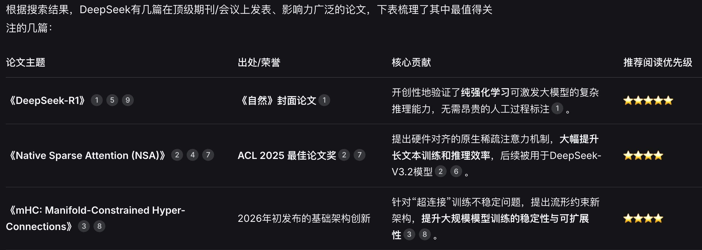

# DeepSeek论文学习

## 为什么这些论文值得一读
这几篇论文分别在不同方向上做出了重要贡献：

DeepSeek-R1：其重要性不仅在于技术突破（纯强化学习），更在于它作为首个经过《自然》严格同行评审的主流大模型，为行业树立了开放、可复现的科研标杆。其最新的86页详细技术报告包含了大量可复现的细节。

Native Sparse Attention (NSA)：直击大模型处理长文本时计算成本高昂的痛点，其设计具有很强的硬件友好性，能直接将理论效率提升转化为实际训练和推理的加速与成本下降。

mHC架构：这是在Transformer基础架构层面的重要探索。它改进了经典的残差连接范式，旨在解决千亿参数以上大模型训练的稳定性难题，可能为下一代大模型架构指明方向。

## 📚 如何选择阅读
你可以根据自己的兴趣和背景来选择：

如果你关注大模型的未来和训练方法，想了解如何让AI更“自主”地思考，优先阅读《DeepSeek-R1》。

如果你是工程师或研究者，关心如何高效地训练和部署长上下文模型，NSA论文是最佳选择。

如果你深耕AI底层架构，想了解大模型训练稳定性的前沿解决方案，可以重点阅读《mHC》。

如果你想了解某一篇论文更具体的技术细节或影响，我可以为你进一步介绍。